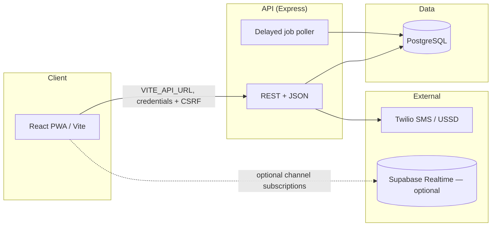
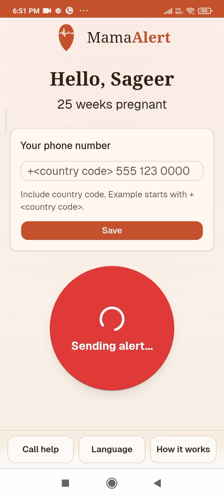
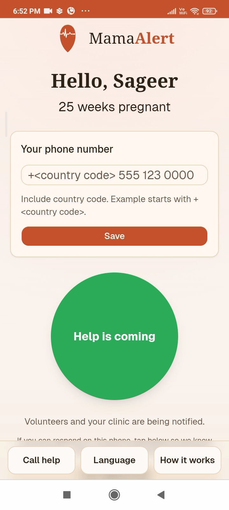
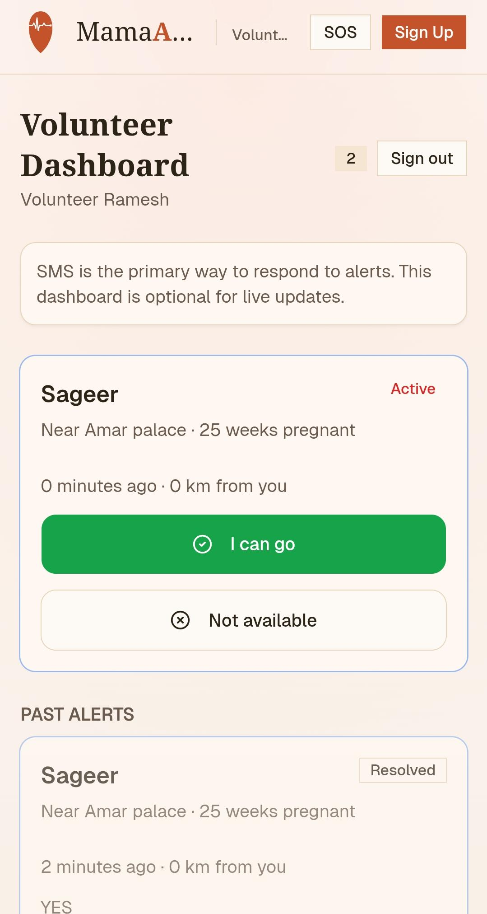
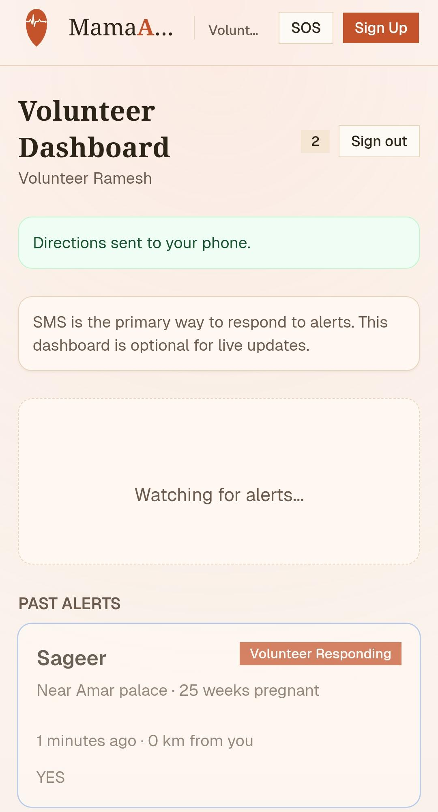
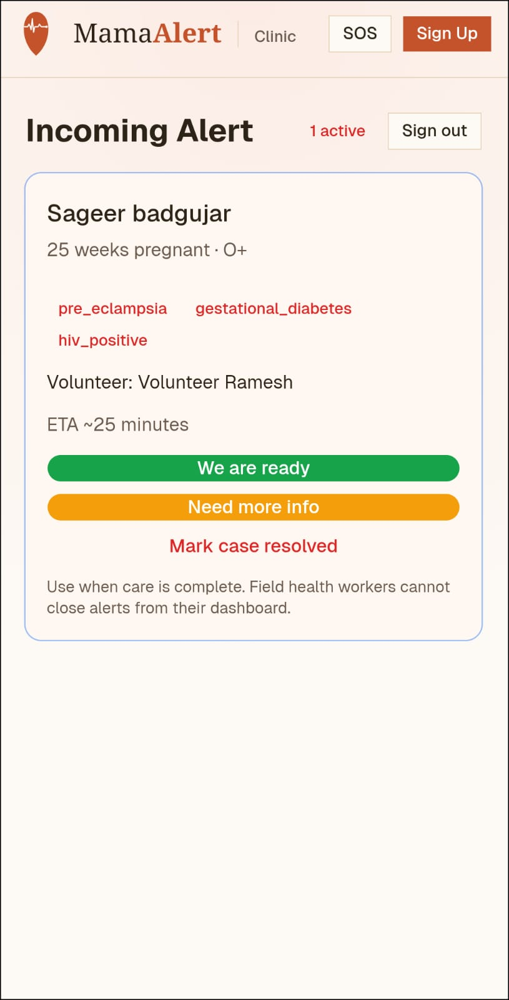

# MamaAlert

Maternal emergency alerting: patients trigger SOS from a React PWA; an Express API coordinates volunteers, hospitals, SMS/USSD flows, and family status links. Postgres is the source of truth (Prisma); Twilio carries production telephony.

## Architecture



- **Patient PWA**: installable `/sos` scope, Workbox offline shell for SOS routes, IndexedDB queue + Background Sync for alerts when offline.
- **API**: Node **≥ 20**, TypeScript compiled to `dist/`, layered routes under `/api/*`, Zod-validated payloads where used, `express-rate-limit` on general, patient-hint, and SOS paths.
- **Data**: PostgreSQL with Prisma migrations; patient/volunteer/hospital coordinates use PostGIS `geography` types (spatial writes go through helpers/RPC—not plain Prisma scalar updates).

## Tech stack

| Area | Choice |
| --- | --- |
| Client runtime | React 18, React Router 6, TypeScript |
| Client build | Vite 7, `vite-plugin-pwa`, Tailwind 3 |
| Client data / UX | Axios, react-hook-form, Zod, i18next, Leaflet maps, Supabase JS (realtime optional) |
| Server | Express 4, Helmet, CORS, JWT (portal sessions), Vitest |
| ORM | Prisma 6 → PostgreSQL |
| Integrations | Twilio SDK; Africa’s Talking (`AT_USERNAME`, `AT_API_KEY`) for alternate SMS/USSD flows where configured |

## Repository layout

| Path | Purpose |
| --- | --- |
| `client/` | Vite SPA/PWA: Tailwind UI, locales, service worker scoped to `/sos/` |
| `server/` | Express entry `src/index.ts`, `createApp()` in `src/app.ts`, Prisma schema + migrations |
| `server/Procfile` | Railway web process when the service root is `server/` |
| `client/src/assets/screenshots/` | Product screenshots (landing + readme) |

Core server routes (see `server/src/app.ts`):

| Prefix | Role |
| --- | --- |
| `GET /api/health` | Liveness |
| `GET /api/health/db` | DB reachability (optional `HEALTH_DB_TOKEN` via `X-Health-Db-Token`) |
| `/api/public/*` | Public patient-facing hints/access (rate-limited) |
| `/api/sos/*` | SOS submission (stricter rate limit) |
| `/api/status/*` | Family / token-based status surfaces |
| `/api/auth/*` | Auth (sessions; CSRF on mutating dashboard calls) |
| `/api/volunteer/*`, `/api/hospital/*` | Volunteer and hospital dashboards |
| `POST /api/sms-reply`, `POST /api/sms-status` | Twilio webhooks |
| `POST /api/ussd` | USSD-style menus (Twilio signature validation middleware) |

## Prerequisites

- **Node.js ≥ 20** (see `server/package.json` `engines`)
- **PostgreSQL** reachable by Prisma (`DATABASE_URL`); migrations need a **direct** connection (`DIRECT_DATABASE_URL` or `MIGRATION_DATABASE_URL` overrides for `migrate deploy`)

## Local development

1. **Install**

   ```bash
   cd server && npm ci
   cd ../client && npm ci
   ```

2. **Environment**: run `npm run env:init` in **both** `server/` and `client/` so `.env` files are seeded from examples when missing (`predev` also runs init on `npm run dev`).

3. **Database**: from `server/`, apply schema — `npm run db:migrate` during development or `npm run db:deploy` against shared/staging/production databases.

4. **Run**

   ```bash
   # terminal 1 — API (default PORT from .env, often 3000)
   cd server && npm run dev

   # terminal 2 — PWA dev server (Vite)
   cd client && npm run dev
   ```

   Point the client at the API with `VITE_API_URL` (e.g. `http://localhost:3000`) in `client/.env`.

5. **SMS without Twilio**: set `TWILIO_MOCK=true` in `server/.env` for local telephony mocking.

Production `npm start` runs `server/scripts/start.cjs`, which runs `prisma migrate deploy` then `node dist/index.js`. Startup **fails closed** on migration errors only when `REQUIRE_DB_MIGRATIONS_ON_START=true` or `npm run start:strict`.

## Server environment variables

**Core**

| Variable | Purpose |
| --- | --- |
| `DATABASE_URL` | Prisma connection (pooler OK in production, e.g. Supavisor `6543` + `pgbouncer=true`) |
| `DIRECT_DATABASE_URL` | Direct Postgres URL for migrations (`5432`) |
| `MIGRATION_DATABASE_URL` | If set, substituted as `DIRECT_DATABASE_URL` during `migrate deploy` in `start.cjs` |
| `CLIENT_URL` | Primary browser origin for CORS |
| `CLIENT_ORIGINS` | Optional comma-separated extra allowed origins |
| `SERVER_PUBLIC_URL` | Public API base URL for Twilio signatures and callbacks |
| `SOS_SIGNING_SECRET` | Signed SOS link material (min length enforced in dev examples) |
| `PORTAL_JWT_SECRET` / `AUTH_SESSION_JWT_SECRET` | Portal/session JWT signing |
| `ADMIN_SIGNUP_CODE`, `HEALTH_WORKER_SIGNUP_CODE` | Bootstrap signup gates |

**Twilio**

| Variable | Purpose |
| --- | --- |
| `TWILIO_ACCOUNT_SID`, `TWILIO_AUTH_TOKEN`, `TWILIO_NUMBER` | Live SMS/Voice |
| `TWILIO_MOCK=true` | Skip live Twilio (local/dev) |

**Supabase (server)**

| Variable | Purpose |
| --- | --- |
| `SUPABASE_URL`, `SUPABASE_SERVICE_ROLE_KEY`, `SUPABASE_ANON_KEY` | Server-side Supabase integration when enabled |

**Operations / tuning** (non-exhaustive; see `server/dev.env.example`)

- `PUBLIC_APP_URL`, `COORDINATOR_PHONE`, `SMS_SOS_KEYWORDS`, `INCAPACITATION_DELAY_MS`, `ESCALATION_DELAY_MS`
- `AT_USERNAME`, `AT_API_KEY` — Africa’s Talking
- `SELF_REG_FALLBACK_LAT` / `SELF_REG_FALLBACK_LNG` — signup when geolocation is blocked
- `TRUST_PROXY_HOPS` — `trust proxy` for rate limiting behind Railway/reverse proxies

## Client environment variables

Deploy-time (Vite `VITE_*`):

| Variable | Purpose |
| --- | --- |
| `VITE_API_URL` | Public API origin |
| `VITE_SUPABASE_URL`, `VITE_SUPABASE_ANON_KEY` | Optional realtime subscriptions for dashboards |
| `VITE_HELP_PHONE` | Help contact shown in patient flows |
| `VITE_DEMO_SOS_TOKEN`, `VITE_DEMO_STATUS_TOKEN` | Optional demo tokens |

## Twilio webhooks

Configure Twilio to `POST`:

- `{SERVER_PUBLIC_URL}/api/sms-reply`
- `{SERVER_PUBLIC_URL}/api/ussd`

Outbound status callbacks:

- `{SERVER_PUBLIC_URL}/api/sms-status`

Webhook routes validate Twilio signatures unless `TWILIO_MOCK=true`.

## Security model (summary)

- **Dashboard auth**: cookie-first (`credentials: true` from the PWA origin); HttpOnly session cookies plus a **readable CSRF cookie**; mutating requests expect `X-CSRF-Token`. Legacy bearer usage may remain as a transitional path.
- **CORS**: allowlist derived from `CLIENT_URL` / `CLIENT_ORIGINS`.
- **Patient SOS**: time-limited signed tokens in links; treat shared SOS URLs as secrets.
- **Helmet** + structured error handler in `createApp()`; sensitive 4xx vs 5xx logging split.

## Data model (Prisma)

Representative entities: `Zone`, `HealthWorker`, `Patient`, `Volunteer`, `Hospital`, `Alert`, alert responses/hospital acks/outbound message timelines, OTP challenge tables for patient/volunteer flows. See `server/prisma/schema.prisma` for full relations and enums.

## Offline and operations

- Patient SOS queue: **IndexedDB** + **Background Sync** until the API accepts the alert.
- Health-worker drafts persist locally until the server acknowledges.
- The API records timeline and delivery states for admin dashboards (escalations, unresolved age, messaging).

## Screenshots

Captured from the live PWA — same alert, three points of view.

### Patient

| Sending alert | Help is coming |
| --- | --- |
|  |  |

### Volunteer

| Active alert | After responding |
| --- | --- |
|  |  |

### Clinic



## Verification (manual)

Suggested pre-release checks:

```bash
cd server && npm test && npm run build && npm audit
cd client && npm run lint && npm run i18n:check && npm run build && npm audit
```

Optional client scripts: `npm run session:check`, `npm run assets:check`.

There is intentionally **no bundled CI workflow** in this repo.

## Deployment notes

- **Railway**: use `server/Procfile` when the Railway service root is `server/`. Set `CLIENT_URL` to the deployed PWA origin.
- **Supabase + pooled DB**: Prefer **transaction pooler** for `DATABASE_URL` (`pgbouncer=true`) and **session/direct** URL for migrations (`DIRECT_DATABASE_URL` or `MIGRATION_DATABASE_URL`). Use `REQUIRE_DB_MIGRATIONS_ON_START=true` only when the migration URL is guaranteed reachable from the container.
